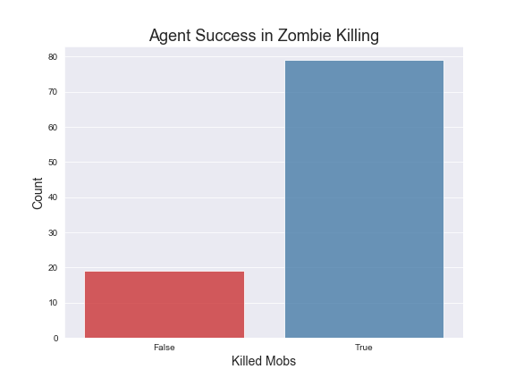

## VIDEO

<iframe width="560" height="315" src="https://www.youtube.com/embed/Y0poiHRE6E4" frameborder="0" allowfullscreen></iframe>

## PROJECT SUMMARY

Project RamboSteve aims to teach an AI agent to efficiently use a sword and bow to kill multiple mob types. Our arena is an enclosed cuboid that spawns one enemy per episode. The Cuboid is layered with barrier blocks to ensure that the environment is not destroyed while training our agent.

Currently, the agent is trained on a Q-table to find the optimal strategy for killing an enemy. At the beginning of each episode, the agent and enemy statically spawn facing one another. Following the initial spawn, the agent gets an observation and has multiple actions that it can take, such as moving forward or backward, attacking, using an inventory slot, and switching weapons. Based on the Q-table, the agent must take a chosen action and return a reward to update the Q-table for the given action. Since we use a Q-Table, our state space must be discretized. We keep track of distance, health, and weapons as our states. However it is important to note since the agent's camera angles are continuous, we simplify our discrete state space by automatically calculating the angle the agent must face prior to taking an action at each observation. 

## APPROACHES

### Q-Tabular Learning

Our approach for our current implementation uses Q-Tabular learning. In short, our implementation is a table of values for every state and action that we define in our environment. We begin by initializing all of our States, Actions, and Rewards (S, A, and R) to be uniform (all zeros). We then make our agent choose an action given an observation. As we observe the rewards that we obtain for each action, we update our table accordingly.
Our action is chosen based on our Q-Table and epsilon. Given a state, our agent chooses an action in the table with the highest Q-Value with a  $$ \epsilon $$  chance of selecting a random action. If there is a set of actions with the same maximal Q-value, we randomly select one action from the set of actions. When an action is completed, we must get our new state and reward from the environment, along with updating our Q-Table with the knowledge that is obtained from the previous action.

### Update Equation
For each state and action, we update our Q-Table using the Bellman Equation. Our implementation is based on the following image.

We then further experimented with different implementations by checking the implementation of the Bellman Equation from Assignment 2. Instead of multiplying the flat Gamma value to our reward. We instead compute G, sum of all of the gammas taking into account the discount rate per iteration for each reward as our Table's reward Queue is updated. Using this new Gamma value G, we simply substitute the gamma variable in our Bellman Equation. We accomplish this as follows:

        G = sum([gamma ** i * R[i] for i in range(len(R))])
        q_table[curr_s][curr_a] = old_q + alpha * (G - old_q)

As displayed above, G is the new gamma value taking into account the discount rate per iteration. The variables old_q and alpha correspond with the current q-value before the update and the learning rate respectively.

### Hyperparameters

The hyperparameters that we previously trained our agent on is shown as follows:

        alpha = 0.3, gamma = 1, epsilon = 0.6, back_steps = 5

These values were previously assigned based our team's initial predictions that our agent would perform. However, after some testing and several design changes we decided that our agent was taking too many random actions and was not being as efficient as possible with the bow. Our new hyperparameters are:

    alpha = 0.3, gamma = 0.9, epsilon = 0.2, back_steps = 10

After some changes we realized that our epsilon was not working as we expected. After changing the implementation, we decided on a low epsilon to encourage our agent to choose less random actions and more optimal actions. In addition, our gamma was reduced to 0.9 to take into account decay rate in rewards through every iteration. Our backsteps were also increased to 10 in order to encourage our agent to completely draw the bow before firing to increase damage output and accuracy. We found that these changes helped our agent fight mobs that it would have otherwise never won against in the baseline, such as Witches and Blazes.

### States

Our program separates the world into weapons, distance, health and mob type. For our weapons, our agent can use the switch command to move between either a sword or a bow. We also include each of our trained mob types as a state. 
        
        WEAPONS = ['sword', 'bow']
        MOBS = {'Skeleton':1.95, 'Spider':1, 'Zombie':1.95, 'Ghast':4, 'Silverfish':0.3, 'Blaze':2, 'Witch':1.95, 'Wolf': 0.85}

However, distance and health are near continuous and cannot be represented in a Q-Table. We solve this problem by discretizing our distance and health states. This reduces our state space significantly and therefore allows our agent to learn more quickly. We also include each of our trained mob types as a state.

        DISTANCE = ['close', 'near', 'far']
        HEALTH = ['low', 'med', 'high']

For distance and health, we define the 3 different states for each state space accordingly:

        DISTANCE[0] if distance < 3 else DISTANCE[1] if distance < 6 else DISTANCE[2]
        HEALTH[0] if health < 4 else HEALTH[1] if health < 14 else HEALTH[2]

Every permutation of these states is a cell in our Q-Table. In total we have 144 states. We also have a list of actions that our agent can take. These actions are listed below:

        ACTIONS = {'sword': ['move 1', 'move -1', 'strafe 1', 'strafe -1', 'attack 1', 'switch'], 
                    'bow': ['move 1', 'move -1', 'strafe 1', 'strafe -1', 'use 1', 'use 0', 'switch']}

### Observations and Rewards

Between every action our agent gets an observation of the world. At every observation, we keep track of the agent health, mob health. Using these two types of values, we are able to obtain the health lost and damage dealt per observation. This is accomplished by subtracting the agent health and mob health of the current observation from the agent health and mob health from the previous observation. Given the health lost and damage dealt per observation, we are then able to use this data on a reward function that helps train our agent.

Our baseline reward function was very basic. We measure our reward on the amount of health lost and damage dealt. The reward algorithm is calculated using the health lost and damage dealt per mission, along with our HEALTH_REWARD and DAMAGE_DEALT_REWARD as follows:
        
        health_lost * HEALTH_REWARD + damage_dealt * DAMAGE_DEALT_REWARD

HEALTH_REWARD is set to -10, and DAMAGE_DEALTH_REWARD is set to 15. We placed more emphasis on the reward returned from damage dealt in order to encourage our agent to kill the enemy instead of backing off and avoiding damage too much. Through experimentation, we also decided to test other rewards such as a reward for the amount of time spent per episode and a reward for killing an enemy. This is shown as follows:
        
        reward = health_lost * HEALTH_REWARD + damage_dealt * DAMAGE_DEALT_REWARD + episode_time * EPISODE_TIME_REWARD
        
        if mob_health == 0:
            reward += KILL_REWARD

Our episode_time denotes the amount of time that has passed in the episode. EPISODE_TIME_REWARD is set to -0.1 and KILL_REWARD is set to 100. Both of these rewards are implemented in order to encourage our agent to finish the mission faster by killing the enemy.

## EVALUATION

 

- Baseline randomly choosing
- Learning with our agent with hyperparameters
- Killing mob types that it wasn't able to kill before (graph of witch deaths)
- learning to completely draw a bow
- some problems with agent rewards still not converging, possibly needs to run for  - many more episodes

## REFERENCES

[Simple Reinforcement Learning with Tables] (https://medium.com/emergent-future/simple-reinforcement-learning-with-tensorflow-part-0-q-learning-with-tables-and-neural-networks-d195264329d0)

[Reinforcement Learning Practice] (https://github.com/dennybritz/reinforcement-learning)

[Malmo Tabular Q-Learning] (https://github.com/Microsoft/malmo/blob/master/Malmo/samples/Python_examples/tabular_q_learning.py#L375)

[Team Babylon Inspiration] (https://ststevens.github.io/TeamBabylon/)

[Malmo Schemas] (http://microsoft.github.io/malmo/0.30.0/Schemas/Mission.html)

[Malmo Documentation] (https://microsoft.github.io/malmo/0.30.0/Documentation/index.html)
