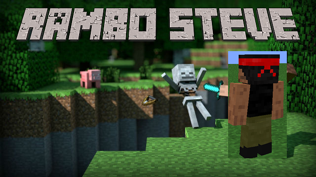

Source code: <a href="https://github.com/rlee97/RamboSteve">Rambo Steve Github Repo</a>

Reports:

- [Proposal](proposal.html)
- [Status](status.html)
- [Final](final.html)

Our team is creating a bot that targets and attempts to kill the enemy in the most efficient way. Our bot uses Q-learning to decide between attacking, advancing, or retreating. We use Microsoft's Project Malmo to interact with Minecraft. 

[quickref]: https://github.com/mundimark/quickrefs/blob/master/HTML.md
